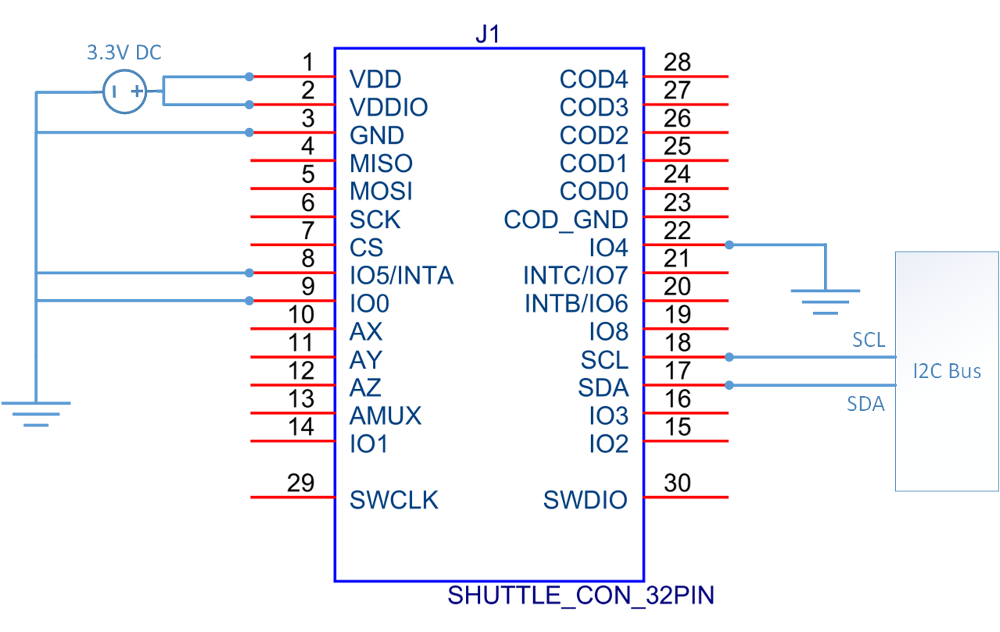
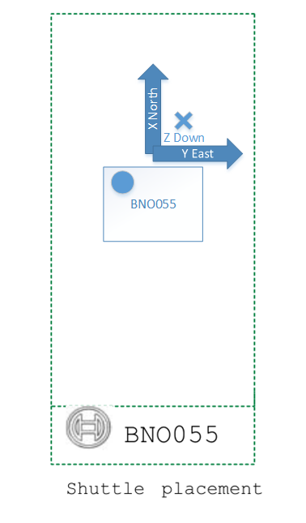
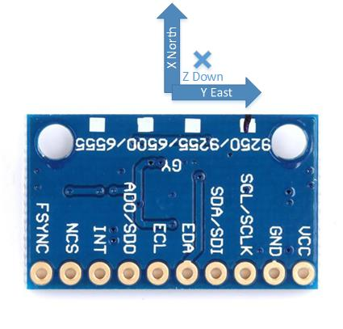

# Absolute Orientation API

Library to acquire standarized orientation data under a unified API for ROV software.

An actual I2C interface with an orientation sensor is needed for library to work correctly with the following exposed API (included in code as an **abstract class**):


```{.py}
class I2CCom(ABC):
    def __init__()
    def set_i2c_address(i2c_address: int)
    def write(register: int, value: int)
    def read_register(register: int) -> int
    def read_register_burst(register: int, n: int) -> list
```

## Installation

1. **Python 3.7+** compatible library.
2. Git clone repository.
3. Run **python -m pip install --upgrade setuptools**
4. Run **python -m pip install ./absolute_orientation**

## Functionalities

- Yaw, Pitch, Roll data in -180 to 180 euler degrees.
- **NED** world frame is used.
- Orientation can be acquired through events for continous data flow or through polling.
- Model compatibility: **MPU9250, BNO055.**

## Interface API

```{.py}
class IAbsoluteOrientation(ABC):
    def __init__(self, com: I2CCom, **kwargs):
    def start_daemon(self) -> bool:
    def stop_daemon(self) -> bool:
    @property
    def is_daemon_running(self) -> bool:
    @property
    def is_detected(self) -> bool:
    @property
    def is_calibrated(self) -> bool:
    def calibration_routine(self) -> bool:
    def init_sensor(self) -> bool:
    def get_position(self) -> Tuple[float, float, float]:
```

## Quick Usage

```{.py}
from absolute_orientation import get_bno055

i2c_com = Concrete_I2CCom()  # System dependant
sensor = get_bno055(i2c_com)
yaw, pitch, roll = sensor.get_position()
```

### Calibration

Calibration is almost mandatory to get correct orientation results. It's called
through the same interface for different SiP models but executed differently so
this should be considered and look at [Examples](examples.html).

A calibration file is generated to avoid calibrating everytime the sensor is
started.

```{.py}
# Setting up a path to save calibration data files.
sensor.set_datapath('/home/user/')

# Calibration returns true when calibration is successful.
success = sensor.calibration_routine()
```

### Load calibration data

If calibration data is loaded from other than default store location, sensor
must be initialized manually.

```{.py}
from absolute_orientation import get_bno055

i2c_com = Concrete_I2CCom()  # System dependant
sensor = get_bno055(i2c_com)
sensor.set_datapath('/home/user/')
sensor.init_sensor()  #  Calibration data loaded from /home/user/
```

## Sensor pins and placement

Sensor pin connection requirements and sensor placement relative to ROV position at origin.

### Bno055





### Mpu9250



## Changelog

Ver [CHANGELOG](CHANGELOG.md)
