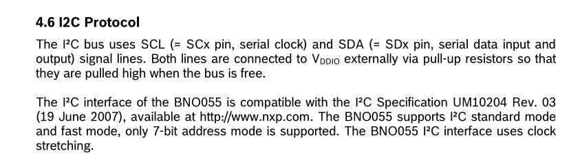
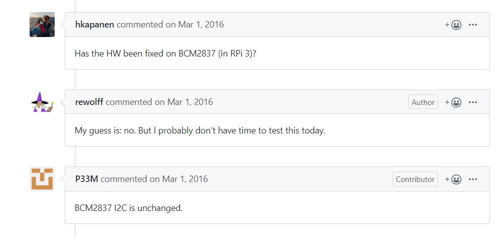

# Known Issues

Here is a **constant work in progress** list of known issues being detected and debugged using this library in development and production.

# Model Bno055

## I2C wrong reads/writes on RPi

Small percentage of errors when reading i2c data on raspbian are reported on several webpages. According to these reports source of error is a bug at I2C implementation of IC BCM2835.

Workaround used is presented (here)[https://gps-pie.com/pi_i2c_config.htm].

### Reports

- [I2C - Small percentage of corrupted data](https://www.raspberrypi.org/forums/viewtopic.php?f=44&t=177915&sid=bb5b653392ffe48f8fa66eaa936ac9f0) - Raspberry Forums
- [Raspberry Pi I2C clock-stretching bug](https://www.advamation.com/knowhow/raspberrypi/rpi-i2c-bug.html) - Advmantation Mechatronic report.
- [I2C Broadcom bug workaround](https://github.com/raspberrypi/linux/issues/254) - Github, raspberry repository.
- [BNO005 and the Raspberry Pi I2C bug](https://hackaday.io/project/8343-borgcube-rov/log/33629-bno005-and-the-raspberry-pi-i2c-bug) - Hackaday, BorgCube ROV.

According to **Bno055 datasheet**, it uses *clock stretching* for I2C interface.

Also, according to github discussions **BCM2837 (RPi 3 Model B)** uses an unchanged hw version of I2C which includes a bug already presented **BCM2835**.

