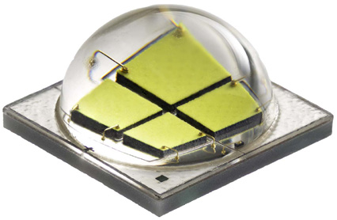

# LED PWM Firmware

Firmware for LED Light control targeting an **ATtiny402 microcontroller**. Light is emitted by a **Cree ® XLamp ® MK-R LED** and intensity is controlled by fast switching using an **Allegro A6211** driver.

Microcontroller receive PWM signals with pulse width range between 1100[μs] and 1900[μs]. This values should be mapped to a **0% to 100%** range of light intensity using **PWM output** and **Allegro A6211** driver.

## References

- [ATtiny402 Datasheet (PDF)](./docs/ATtiny202-402-DataSheet-DS40001969B.pdf)
- [ATtiny402 online documentation](https://onlinedocs.microchip.com/pr/GUID-48B1591A-DAFD-4D0E-9838-C6AB39884626-en-US-3/index.html?GUID-54786BFB-C48D-4C7A-B59C-6A17903BFA82)
- [Official Microchip documentation list](https://www.microchip.com/wwwproducts/en/ATtiny402)
- Online AVR® Code API Reference Manual ?? (Seems Hidden) [Link](https://onlinedocs.microchip.com/pr/GUID-317042D4-BCCE-4065-BB05-AC4312DBC2C4-en-US-1/index.html)
- [Newbie’s Guide to AVR Interrupts](https://www.avrfreaks.net/sites/default/files/Interrupt.pdf)
- [Cree XLamp MK-R Official Documents](https://www.cree.com/led-components/products/xlamp-leds-arrays/xlamp-mk-r)
- Atmel Studio and git repository: [TUT SOFT Using Git with Atmel Studio 7](https://www.avrfreaks.net/forum/tutsoft-using-git-atmel-studio-7)