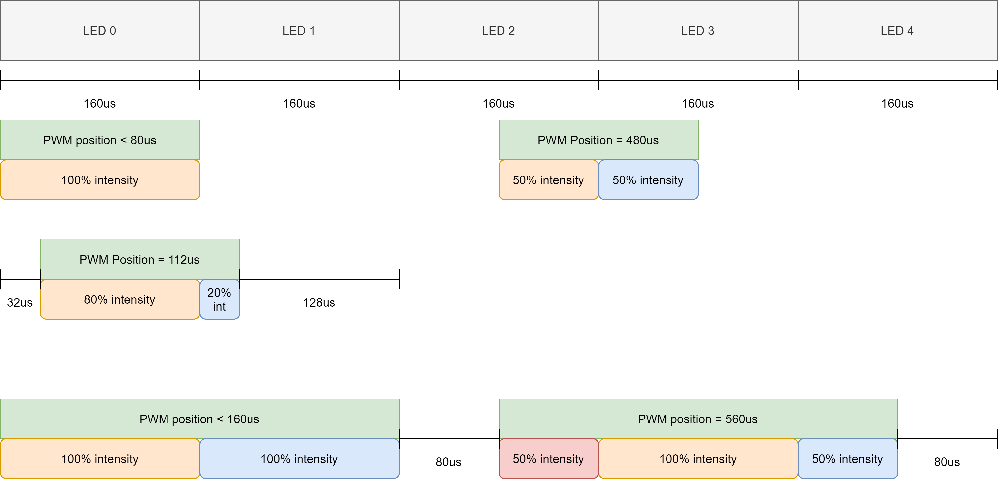

# LED Strip Controller

ATmega328P/Arduino firmware controller for LED array/strip with a settable slicing focus window and intensity percentage. Desired focus and intensity
data is reported via RC PWM signals. Independent LED intensities are controlled via I2C using a PCA9685 module.



## Arduino UNO/Nano Pinout

* **PIN 2:** Input RC PWM led intensity control.
* **PIN 3:** Input RC PWM focus angle control.
* **I2C Bus:** A4(SDA), A5(SCL).

# Build

Project build is done using PlatformIO Core.

```bash
pio run -e uno -t upload
```


