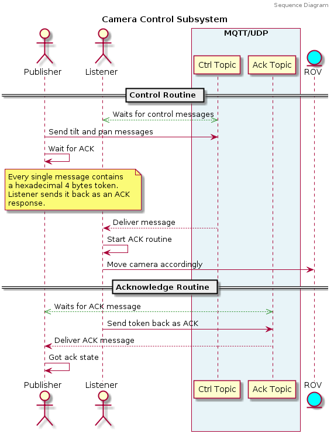
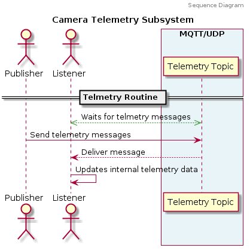

# Camera Control Subsystem

**Mqtt-udp** based library for camera control and camera related telemetry to be used in ROV system as part of GCS - Client communications.

## Installation

1. **Python 3** compatible library
3. Git clone repository
4. Run **python -m pip install ./camera_control_subsystem**

## Library Functionalities

Library includes both camera control and camera telemetry functionality.

### Camera Control

There are two relevant entities in camera control communication **Camera Control Publisher (Publisher)**  and **Camera Control Listener (Listener)**.

Publisher exposes an API to communicate any desired change in camera position to external software (Tilt and pan as target or speed). Listener hears this communication and deliver message to external software callbacks in order to take physical actions to move camera.

Listener also sends back an ACK message to Publisher but checking for it before sending a new message is completely **optional**.

### Camera Telemetry

There are also a **Telemetry Publisher (Publisher)** and a **Telemetry Listener (Listener)**. Publisher exposes any relevant data through a  key/value pair data structure (python dictionary, java hash tables, etc).

Listener store telemetry data and keep it updated as an internal dictionary. Data is accessible through a direct request of the python dictionary (polling) or a callback can be registered.

## Camera Interface API

Exposed API to access the whole functionality of control and telemetry.

### For Master (GCS)

- **set_telemetry_topic(topic: str)**
- **send_telemetry( * * kwargs)**
  - Example: send_telemetry(depth='10.0', temperature='6.0')
- **set_control_topic(topic: str)**
- **set_control_ack_topic(topic: str)**
- Additional public fields to manage control callback system. Signature is expected as `callback(data: float)` for speed control and as `callback(data: int)` for step control. Reset does't deliver any data to callbacks.
  - **tilt_step_callbacks: set**
  - **pan_step_callbacks: set**
  - **tilt_speed_callbacks: set**
  - **pan_speed_callbacks: set**
  - **reset_position_callbacks: set**

### For Client  (Tablet)

- **set_telemetry_topic(topic: str)**
- **get_telemetry() -> dict**
- **clear_telemetry_data()**
- **add_telemetry_callback(cb)**
  - Callbacks should have this signature `cb(data: dict)`
- **remove_telemetry_callback(cb)**
- **clear_telemetry_callbacks()**
- **set_control_topic(topic: str)**
- **set_control_ack_topic(topic: str)**
- **send_tilt_step(tilt: int)**
- **send_pan_step(pan: int)**
- **send_tilt_speed(tilt_speed: float)**
- **send_pan_speed(pan_speed: float)**
- **send_reset_position()**
- **got_ack() -> bool**

## Changelog

Ver [CHANGELOG](CHANGELOG.md)

