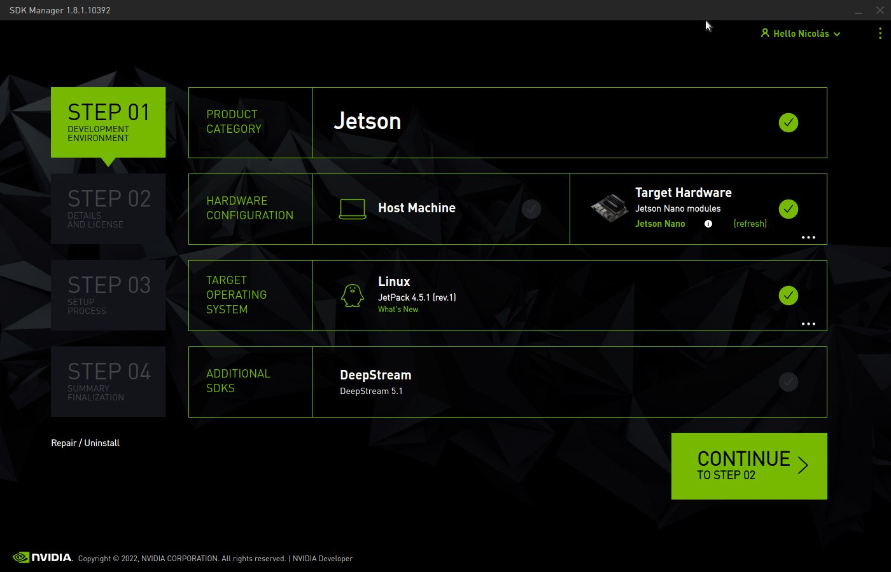

# AN Carga Jetson Nano Funkey Tech
_Puerto Montt, 10 de noviembre de 2022, Nicolás Hasbún A._

Guía general para carga de sistema base en las placas Jetson Nano Funkeytech que contienen memoria emmc integrada. 

Esto considera la instalación de JetPack 4.5.1, configuración de usuarios, configuración de almacenamiento externo y conexión a VPN Atenas. Estas herramientas permiten cargar de forma remota módulos de software pertenecientes a distintos equipos: ROV Mortalidad, ROV Fondo, Rov Lavado de Mallas, etc. 

## Instalación con Nvidia SDK Manager

### Requerimientos
- Ubuntu 18.04 LTS en máquina 64bits

### Pasos

Conectar la placa via USB con alimentación externa e iniciar SDK Manager. Setear según se observa en la imagen.




Iniciar la Jetson en *recovery mode*. Para esto se requiere desenergizar la Jetson y colocar un jumper entre los pines **FC REC** y **GND**. Volver a energizar la placa y retirar el jumper después de unos segundos.


Si todo sale bien deberíamos seguir con la siguiente imagen.


Con esto podemos dar inicio al flasheo de la imagen de Jetpack. Al terminar es necesario entrar por comunicación serial el usuario **insytech**. Se recomienda para esto la herramienta **screen** y un comando del tipo: `sudo screen /dev/{console_port} 115200`.

Luego de crear el usuario ingresar en la interfaz de usuario nombre y clave.


## Expansión de almacenamiento interno

La placa contiene la memoria justa ~100MB libres luego de la instalación.

Vamos a mover toda la carpeta home y otros binarios pesados a almacenamiento externo.

### Formatear memoria externa
```bash
# listar devices con lsblk
_device=xxx

sudo mkfs -t ext2 $_device
sudo e2label $_device insy_data

# Verificar con
lsblk -o +LABEL,FSTYPE

```

### Mover carpeta home y otros

```bash
# identificar disco
# en mi caso por label se llama insy_data

# Montar disco
udisksctl mount -b $_device

sudo cp -rp /home/* /media/insytech/insy_data/

# Desmontar el disco
sudo umount /media/insytech/insy_data/

# Reespaldar home
cd /
sudo mv home home.back

# Montar disco por label
sudo mkdir /home
sudo mount -L insy_data /home

# Agregar a fstab
sudo nano /etc/fstab

# Manually add this
LABEL=insy_data      /home                 ext2           defaults                                     0 0


# Mover carpeta local que es pesada igual
sudo mv /usr/local /home/insytech/_local
sudo ln -s /home/insytech/_local /usr/local

# Libera espacio extra
# https://collabnix.com/easy-way-to-free-up-jetson-nano-sd-card-disk-space-by-40%EF%BF%BC%EF%BF%BC/
sudo apt update
sudo apt autoremove -y
sudo apt clean
sudo apt remove thunderbird libreoffice-* -y
